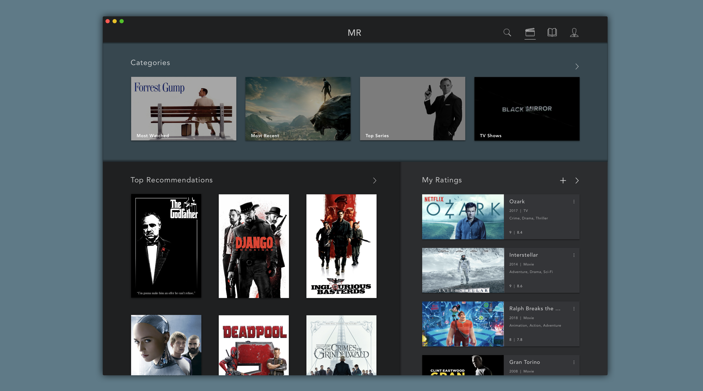

# Media Recommendation
A media recommendation MacOS app that suggests new movies and books to users based on media they rate via Collaborative Filtering DNN's.

This is a sandbox for recommender system ideas I have that are decoupled from any business metrics.

If you have any ideas or feedback, please reach out.

## Models
### [Movies](./MovieRec.ipynb)

The current model is a simple 4 layer MLP with learned User/Movie Embeddings,
learned genre Multi-Hot embeddings, and a few extra scalar movie features. 

Future Work:
- Fixed LLM embedding feature for genres and movie descriptions.
- Incorporating tags, reviews, and other features.

Data: 
- [MovieLens 25M Dataset](https://grouplens.org/datasets/movielens/25m/): 162,000 Users, 62,000 Movies from IMDB, 25M Ratings on a 0.5-5 star scale in half star increments.

### Books
The current model is a simple 4 layer MLP with learned User/Book Embeddings. 
Improving this model is the current focus starting with incorporating additional features.

Data: 
- [Goodreads Dataset](https://sites.google.com/eng.ucsd.edu/ucsdbookgraph/shelves?authuser=0): 750,000 Users, 1M Books from GoodReads, 100M Ratings on a 1-5 scale in one star increments.

### New Users
To efficiently adjust to new user preferences in production we use an 
Embeddings Cluster approach where the model user embeddings are clustered,
then the new user is mapped to the cluster centroid with the closest average cluster ratings.
This improves early predictions before we have enough data to train the new user embedding.

## System Architecture
The MacOS app is written in Swift. We use Django for the backend API, TorchServe as the model server, and a PostgreSQL database. The Django and Torchserve services are deployed on Kubernetes clusters on GKE. The database lives in Amazon RDS.

## Future Work
- [ ] Related media suggestions
- [ ] Podcasts
- [ ] Spotify playlists
- [ ] Explore/Exploit manual adjustment
- [ ] Wish Lists
